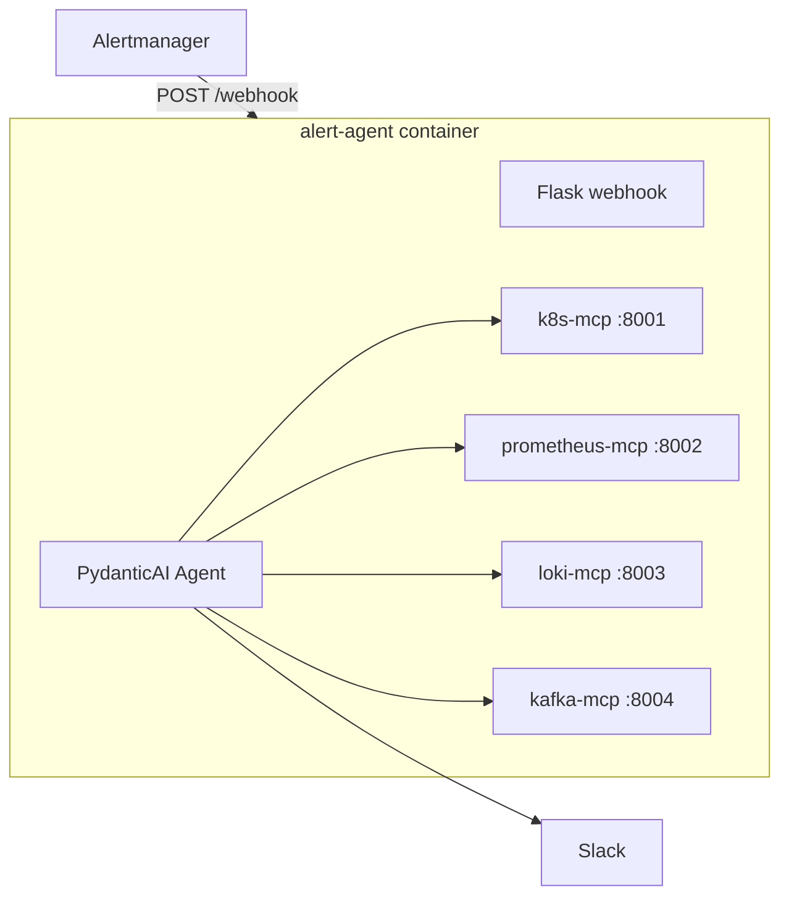

# AI Alert Agent

AI-powered Alertmanager webhook that investigates firing alerts with MCP tools (Kubernetes, Prometheus, Loki, Kafka/MSK) and posts structured RCAs to Slack.

Everything runs in a **single container**: Flask webhook, OpenAI agent, and four MCP servers.

## Architecture



## Local development (docker-compose)

1. Copy `.env.example` to `.env` and set `OPENAI_API_KEY`, `SLACK_WEBHOOK_URL`, `PROMETHEUS_URL`, `LOKI_URL`.
2. Run:

```bash
docker compose up --build
```

Health check:

```bash
curl http://localhost:5001/health
```

Sample webhook:

```bash
curl -X POST http://localhost:5001/webhook \
  -H "Content-Type: application/json" \
  -d @sample/network-pod-high-transmit-alert.json
```

Local compose can reach Prometheus/Loki over the network. **Kubernetes tools** (`k8s-mcp`) use in-cluster ServiceAccount auth when deployed to the cluster — no host kubeconfig or AWS profile is required.

## Kubernetes deployment (dozee-dev / dozee-pro)

Manifests live in [`deploy/k8s/ai-alert-agent.yaml`](deploy/k8s/ai-alert-agent.yaml) and are wired in Flux under `fluxcd-aws/clusters/*/monitoring/kube-prometheus-stack/`.

### Build and push production image

```bash
chmod +x deploy/build-push.sh

# Tags image with git tag (if on a tag) or short SHA; pushes to ECR
TAG=1.0.1 ./deploy/build-push.sh

# Also push :latest
TAG=1.0.1 TAG_LATEST=true ./deploy/build-push.sh

# Build only, no push
PUSH=false ./deploy/build-push.sh
```

**Important:** EKS nodes are `linux/amd64`. On Apple Silicon Macs, always build with `--platform linux/amd64` (the script does this by default). A plain `docker build .` without platform causes `exec format error` in the cluster.

```bash
# Wrong on M1/M2 Mac (builds arm64)
docker build -t ai-alert-agent .

# Correct for EKS
docker build --platform linux/amd64 -t ai-alert-agent .
```

Production image properties:

- Multi-stage build with pinned `python:3.12.8-slim-bookworm`
- Non-root user (`uid 10001`)
- Gunicorn WSGI server (1 worker, 8 threads — MCP servers are single-process)
- MCP readiness wait before accepting traffic
- OCI image labels (`version`, `revision`, `build date`)
- Built-in `HEALTHCHECK` on `/health`

### Create secrets (once per cluster)

```bash
kubectl -n monitoring create secret generic ai-alert-agent-secrets \
  --from-literal=openai-api-key="$OPENAI_API_KEY" \
  --from-literal=slack-webhook-url="$SLACK_WEBHOOK_URL"
```

### In-cluster URLs

| Env | Value |
|---|---|
| `PROMETHEUS_URL` | `http://service-gps.monitoring.svc.cluster.local:9090` |
| `LOKI_URL` | `http://loki-gateway.monitoring.svc.cluster.local` |
| k8s auth | ServiceAccount `ai-alert-agent` (in-cluster) |

Alertmanager receiver `ai-alert-agent` uses `continue: true` so existing Slack routes are unchanged.

## Alert coverage

| Category | Tools |
|---|---|
| Pod CPU/memory/restart/anomaly/OOM | k8s + prom + loki |
| MSK lag / no-message | kafka + prom + k8s/loki |
| EC2 host (`EC2Host*`) | prom node-exporter helpers |
| Blackbox / TLS | prom probe helpers |
| Loki-sourced alerts | deferred (Phase 5) |

## Guardrails

- **Dedup:** same `fingerprint` ignored for `DEDUP_TTL_SECONDS` (default 900s)
- **Allowlist:** optional `ALLOWED_ALERTNAMES` regex env
- **Slack header:** alertname, severity, namespace/pod/instance on every RCA

## RCA output format

Kubernetes alerts:

```text
Namespace: dozeedb
Pod: athenaworker-6f4cd88ccb-nl5vw

Findings:
- ...

Probable Root Cause:
...

Recommended Actions:
1. ...
```

EC2, Blackbox, and MSK alerts use alternate headers documented in [`alert-agent/prompts/rca_prompt.txt`](alert-agent/prompts/rca_prompt.txt).

## Logs

Investigations are saved under `logs/` (PVC `/app/logs` in cluster).
