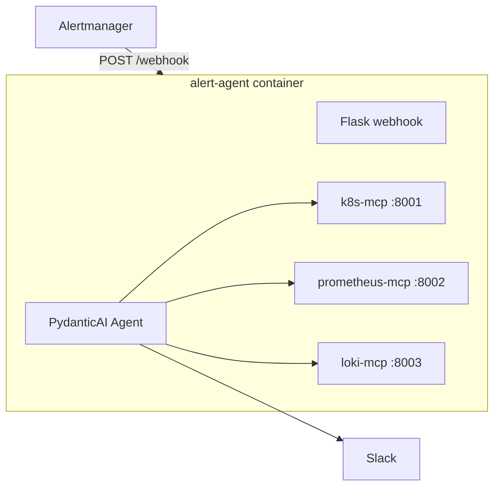

# AI Alert Agent

This repository contains a greenfield AI alert investigation service built around a Flask webhook, OpenAI, and three MCP servers for Kubernetes, Prometheus, and Loki.

Everything runs in a **single Docker container**: Flask webhook, OpenAI agent, and all three MCP servers.

## Architecture



## Prerequisites

- Docker and Docker Compose
- Network access to Prometheus and Loki
- A working kubeconfig on the host machine
- AWS credentials on the host if the kubeconfig uses EKS exec auth
- An OpenAI API key
- A Slack webhook URL

## Local setup

1. Copy `.env.example` to `.env`.
2. Fill in `OPENAI_API_KEY` and `SLACK_WEBHOOK_URL`.
3. Adjust `KUBECONFIG_HOST_PATH`, `AWS_CONFIG_HOST_PATH`, `PROMETHEUS_URL`, and `LOKI_URL` if needed.
4. Run:

```bash
docker compose up --build
```

## Health check

```bash
curl http://localhost:5001/health
```

## Sample webhook test

```bash
curl -X POST http://localhost:5001/webhook \
  -H "Content-Type: application/json" \
  -d '{
    "alerts": [
      {
        "status": "firing",
        "labels": {
          "alertname": "KubePodCrashLooping",
          "namespace": "default",
          "pod": "my-pod-xyz"
        },
        "annotations": {
          "summary": "Pod is crash looping"
        }
      }
    ]
  }'
```

The agent should investigate the alert with MCP tools, send a structured RCA to Slack, and save the same RCA under `logs/`.

You can also test with the sample alert payload:

```bash
curl -X POST http://localhost:5001/webhook \
  -H "Content-Type: application/json" \
  -d @sample/network-pod-high-transmit-alert.json
```

## RCA output format

Slack and log files use this format:

```text
Namespace: dozeedb
Pod: athenaworker-6f4cd88ccb-nl5vw

Findings:
- ...

Probable Root Cause:
...

Recommended Actions:
1. ...
2. ...
```

## Logs

Each investigation is written to `logs/` on the host, for example:

```text
logs/20260622T101500Z_NetworkPodHighTransmit_athenaworker-6f4cd88ccb-nl5vw_a1b2c3d4e5f6.log
```

## Notes

- If your kubeconfig uses EKS exec auth, mount your host `~/.aws` credentials into the container. Set `AWS_PROFILE` in compose only if your credentials require a named profile.
- The sample `.env` values are placeholders. Real investigation requires a valid `OPENAI_API_KEY` and `SLACK_WEBHOOK_URL`.
